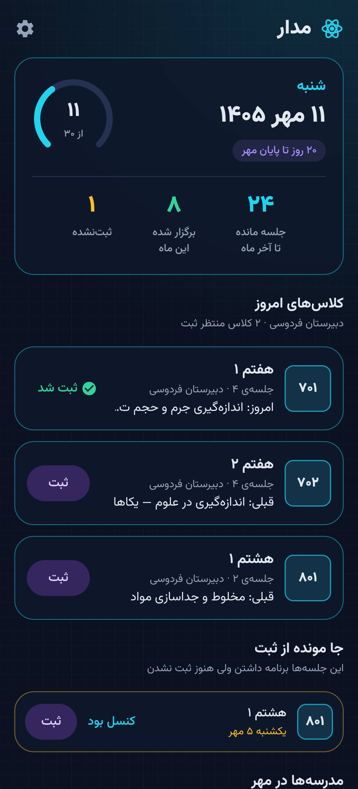
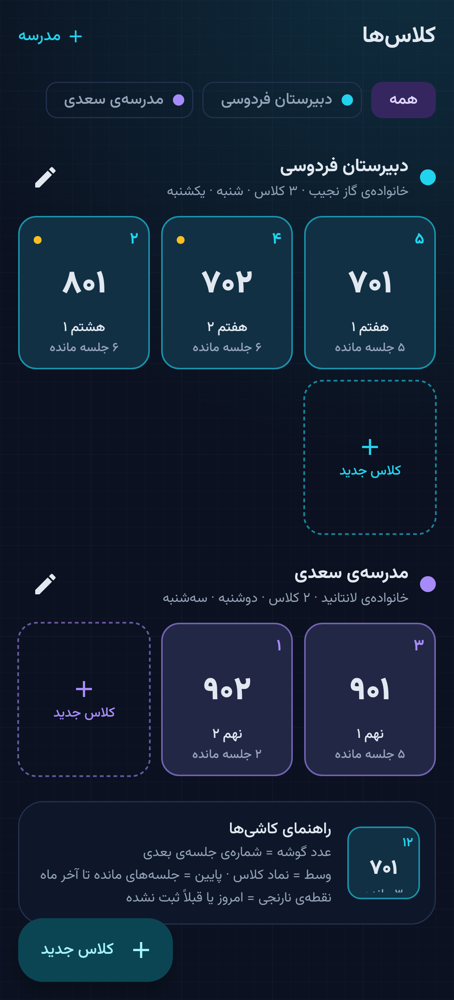
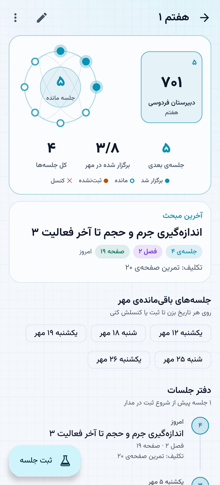
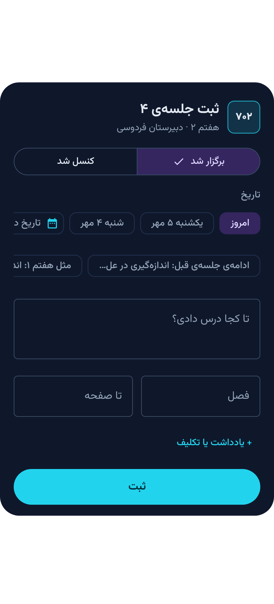
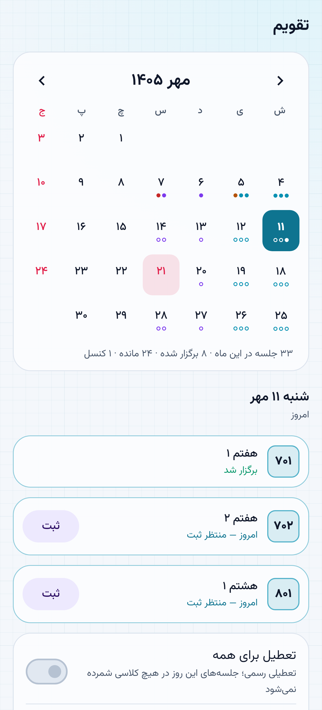
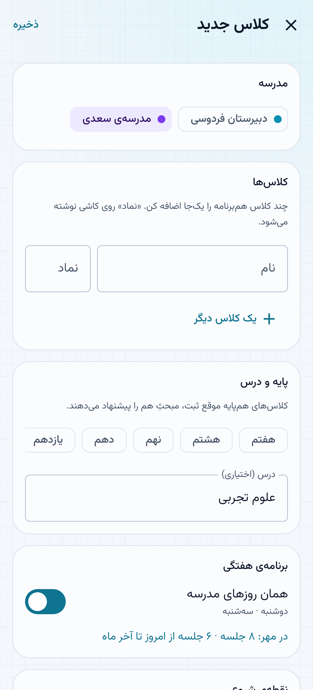

# مدار — دفتر کلاس‌های معلم

اپ اندروید برای اینکه بدانی هر کلاس **تا کجا درس داده شده**، **جلسه‌ی چندم** است و **چند جلسه تا آخر ماه (شمسی)** مانده.

| امروز | کلاس‌ها | جزئیات کلاس |
|---|---|---|
|  |  |  |
| **ثبت جلسه** | **تقویم** | **افزودن کلاس** |
|  |  |  |

## چطور کار می‌کند
- **مدرسه** ← روزهایی که آنجایی (مثلاً شنبه و یکشنبه). **کلاس**‌ها همین روزها را ارث می‌برند (قابل تغییر برای هر کلاس). چند کلاس را می‌شود یک‌جا اضافه کرد.
- جلسه‌های هر ماه **خودکار** از روی روزهای هفته و تقویم شمسی حساب می‌شود.
- **تعطیلی** (برای همه یا فقط یک مدرسه) و **کنسلی** از شمارش کم می‌شوند؛ جلسه در روز غیربرنامه‌ای = **جبرانی**.
- شماره‌ی جلسه = جلسه‌های قبل از شروع استفاده از اپ + جلسه‌های ثبت‌شده.
- روزهای برنامه‌ای گذشته که ثبت نشده‌اند به‌صورت «جا مونده از ثبت» یادآوری می‌شوند.
- پشتیبان‌گیری/بازیابی JSON از تنظیمات.

## نصب
فایل APK را از بخش **Actions → آخرین اجرا → Artifacts → madar-apk** دانلود و روی گوشی نصب کن (اجازه‌ی «نصب از منابع ناشناس» لازم است).

## توسعه
Kotlin · Jetpack Compose · Material 3 · Room · DataStore — حداقل اندروید ۸.

```bash
./gradlew testDebugUnitTest        # تست‌ها (تقویم شمسی، محاسبه‌ی جلسه‌ها، دیتابیس، اسکرین‌شات)
./gradlew recordRoborazziDebug     # ساخت اسکرین‌شات‌ها در app/build/outputs/roborazzi
./gradlew assembleRelease          # APK
```

فونت: [وزیرمتن](https://github.com/rastikerdar/vazirmatn) (OFL، متن مجوز در `licenses/`).
